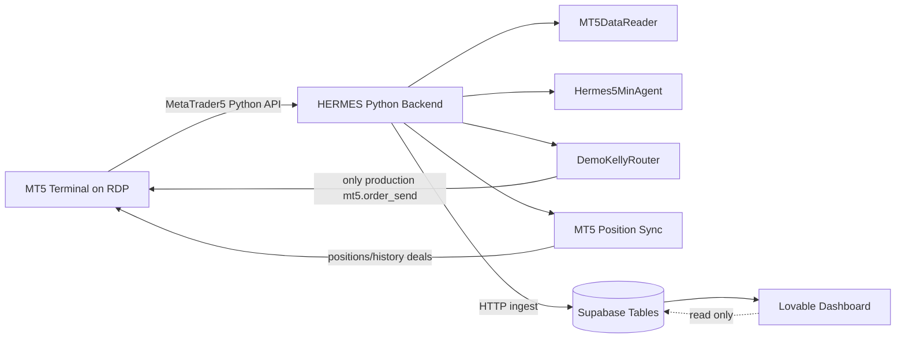
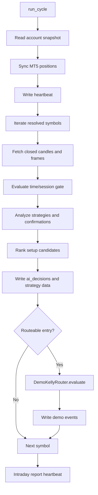
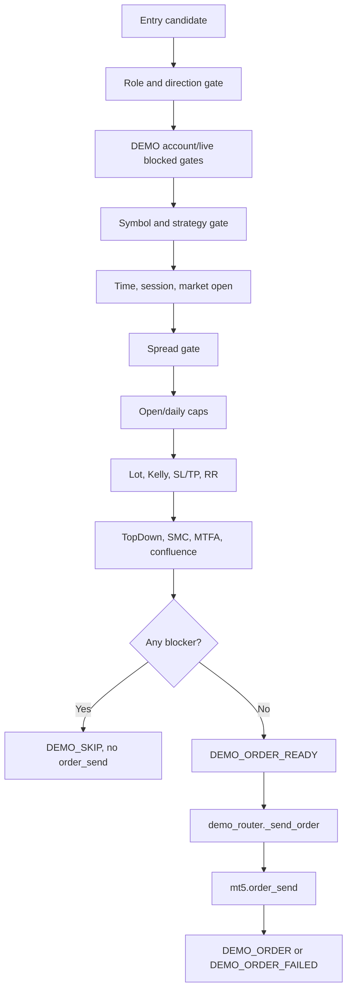
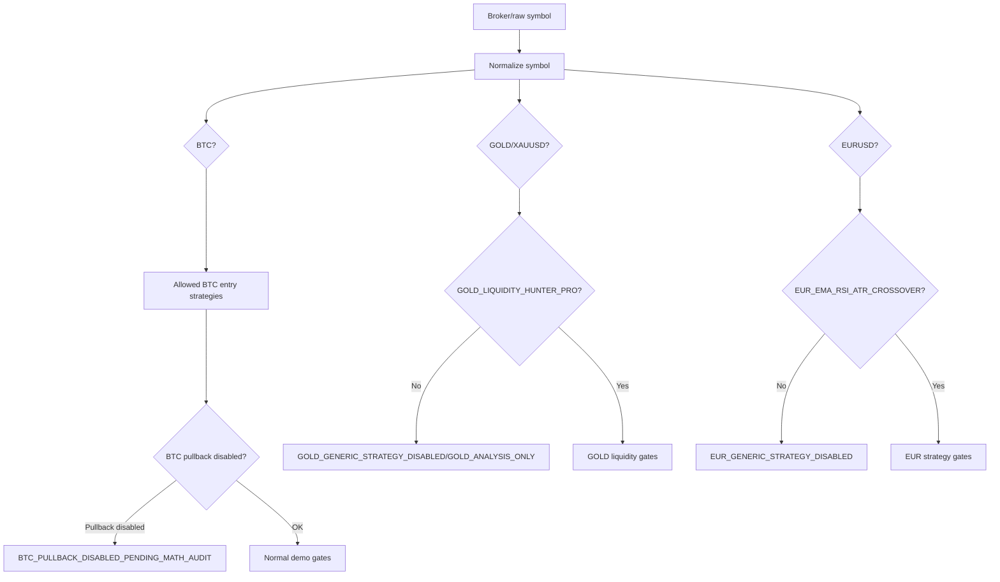
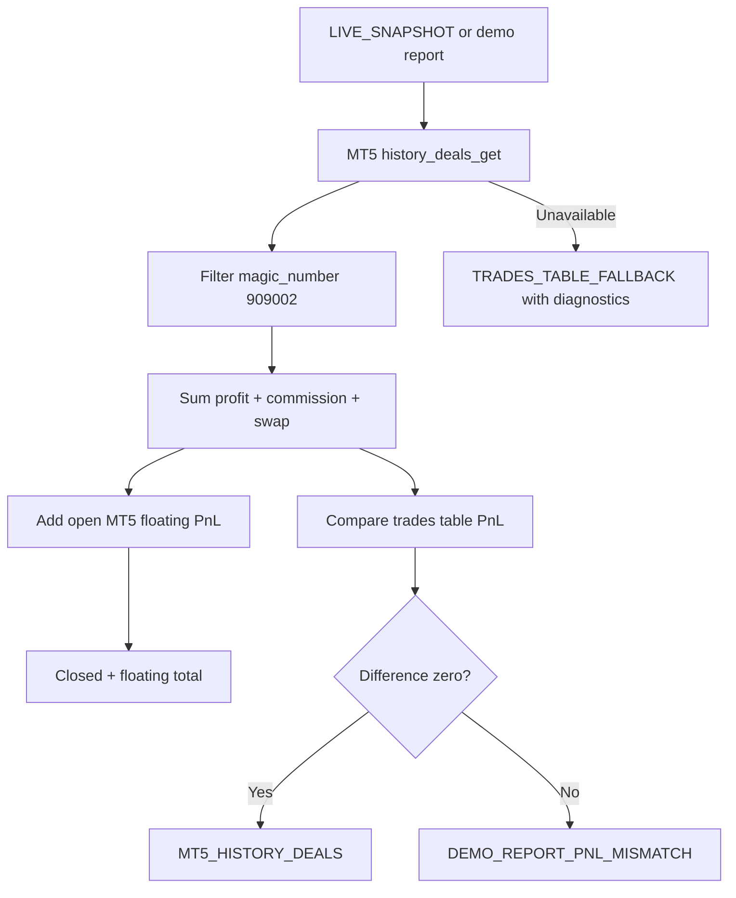

# HERMES System Map

## Executive Summary

HERMES is a Python backend that connects to an MT5 terminal on the RDP, reads closed market candles, evaluates strategy and confirmation modules, applies risk and demo-only safety gates, optionally sends DEMO orders through one centralized router, synchronizes MT5 positions, and publishes dashboard/report data to Supabase for Lovable.

Execution is centralized. The only production `mt5.order_send` call found is in `app/mt5/demo_router.py`. No dashboard, strategy module, observer module, report module, or Supabase client should execute trades.

Live trading is protected by multiple hard gates: `ALLOW_LIVE_TRADING=false`, `DEMO_ONLY=true`, DEMO account checks, trade mode checks, `DEMO_MAX_LOT=0.01`, account trade permissions, symbol gates, spread/time/market gates, SL/TP and RR validation, daily loss checks, open trade caps, and final demo gate consistency before `order_send`.

Current symbol routing in code is:

- BTCUSD / BTCUSD#: tradable through allowed BTC entry strategies, with `QUANT_STATISTICAL_PULLBACK` blockable by `BTC_DISABLE_QUANT_STATISTICAL_PULLBACK`.
- GOLD / GOLD# / XAUUSD: tradable only through `GOLD_LIQUIDITY_HUNTER_PRO` when GOLD liquidity mode and strategy flags permit it; generic GOLD strategies are blocked.
- EURUSD: router and strategy code support `EUR_EMA_RSI_ATR_CROSSOVER`, and generic EUR strategies are blocked. However, `app/main.py::_should_route_to_demo()` currently omits `EUR_EMA_RSI_ATR_CROSSOVER`, so EUR may be analyzed and published but not routed to the demo router unless another path adds it.

The next fixes worth prioritizing are: add `EUR_EMA_RSI_ATR_CROSSOVER` to the main demo routing filter if EUR execution is intended, verify runtime `.env` values for BTC pullback disable/GOLD liquidity mode, confirm D1 candle availability for the Top-Down reader, and continue monitoring MT5-vs-trades-table PnL mismatches.

## 1. High-Level System Overview

HERMES is an MT5 demo trading agent with a Python backend and Supabase/Lovable dashboard layer.

The backend does four main jobs:

- Reads MT5 account state, symbols, ticks, candles, open positions, and history deals.
- Evaluates market state, strategy candidates, confirmation modules, Top-Down, SMC, MTFA, WSP, risk, and execution gates.
- Sends DEMO orders only through `app/mt5/demo_router.py` when the final gate is `PASS`.
- Publishes state, decisions, telemetry, trades, reports, PnL, and heartbeat snapshots to Supabase through the ingest endpoint.

Processes on the RDP:

- MT5 terminal: provides market data, account state, open positions, history deals, and execution API.
- Python HERMES backend: typically launched from `app/main.py`.
- Optional FastAPI/uvicorn bridge processes may exist in the broader workspace, but this codebase's core backend process is `python -m app.main` or `python app/main.py`.
- Lovable dashboard: external frontend that reads Supabase realtime/table data. It must be read-only with respect to trading.

MT5 connects to Python through the `MetaTrader5` Python package. The backend calls:

- `mt5.initialize()` in `app/mt5/connection.py` and `app/services/mt5_pnl_truth.py`.
- `mt5.copy_rates_from_pos()` in `app/mt5/data_reader.py`.
- `mt5.account_info()`, `mt5.positions_get()`, `mt5.symbol_info()`, `mt5.symbol_info_tick()`, and `mt5.history_deals_get()` in reader/sync/report services.
- `mt5.order_send()` only in `app/mt5/demo_router.py`.

Supabase data is written through `app/services/ingest_client.py`. The backend posts JSON payloads to `HERMES_INGEST_URL` with `table` and `data` fields. Lovable reads those rows and displays dashboard panels.

Read-only modules:

- Market readers and confirmation modules: Top-Down, MTFA, SMC, MTF structure, WSP, Markov, Big Setup, optional placeholders.
- Strategy modules before the router: they produce signals/candidates only.
- Reports, PnL readers, and dashboard snapshots.

Executable demo path:

- `app/main.py` routes selected entry decisions to `DemoKellyRouter`.
- `DemoKellyRouter.evaluate()` builds one final demo decision.
- `DemoKellyRouter.process_decision()` returns before execution if blocked.
- `_send_order()` in `app/mt5/demo_router.py` calls `mt5.order_send()` only after `DEMO_GATE PASS`.

## 2. Main Execution Flow

### Startup

`app/main.py` defines `HermesBackend`.

Startup sequence:

1. `get_settings()` loads environment-backed settings from `app/config.py`.
2. Core objects are created:
   - `MT5Connection`
   - `MT5DataReader`
   - `IngestClient`
   - `HeartbeatService`
   - `Hermes5MinAgent`
   - `PaperTradingAgent`
   - `DemoKellyRouter`
   - `SetupHunter`
   - `TimeEngine`
3. `DemoKellyRouter.mark_backend_started()` writes local backend start metadata.
4. `IngestClient.connect()` validates ingest configuration.
5. Startup test rows are sent to `bot_logs`, `bot_status`, and `hermes_agents`.
6. MT5 initializes through `MT5Connection.connect()`.
7. An account snapshot is read.
8. A dashboard heartbeat is written.
9. A separate live snapshot heartbeat thread starts.
10. Symbols are resolved through `SymbolMapper(settings.symbol_list).resolve_all()`.
11. The main loop repeatedly calls `run_cycle()`.

### MT5 Initialization

`app/mt5/connection.py` calls `mt5.initialize()` with retries. It checks terminal and account info, logs account identity, and sets `self.connected`.

`app/services/mt5_pnl_truth.py` also calls `mt5.initialize()` defensively before history reads so reports and snapshots can get MT5 history even if called outside the main connection object.

### Symbol Resolution

`app/mt5/symbol_mapper.py` resolves configured requested symbols to broker symbols.

Resolution order:

1. Exact match.
2. Common suffix variants.
3. Broker symbol starts with requested symbol.
4. `mt5.symbol_select()` validation.

The resulting map is stored as `HermesBackend.resolved_symbols`.

### Candle Fetching

`app/mt5/data_reader.py` fetches candles through `mt5.copy_rates_from_pos()`.

Timeframes currently fetched by `get_all_timeframes()` are:

- M1
- M5
- M15
- H1
- H4

Latest candle writes use the last completed candle, not the forming candle. Strategy modules also generally normalize frames and use closed candles.

Audit note: the Top-Down hierarchy spec references D1. The current `MT5DataReader.TIMEFRAMES` does not include D1, so D1-dependent Top-Down output may be unavailable or reduced unless another path supplies D1.

### Analysis Cycle

`HermesBackend.run_cycle()`:

1. Logs cycle start.
2. Reads account snapshot.
3. Synchronizes MT5 positions to Lovable/Supabase if connected.
4. Writes heartbeat.
5. Iterates each resolved symbol.
6. Sends latest completed candle rows to `market_candles`.
7. Fetches multi-timeframe frames.
8. Reads tick, symbol specs, spread, max spread, equity, and time gate.
9. Processes paper trade closures if paper trading is enabled.
10. Skips if M5 frame is missing.
11. Calls `Hermes5MinAgent.analyze_symbol()`.
12. Sends market state, Markov, strategy signals, Kelly risk, and AI decision rows.
13. Runs `SetupHunter.evaluate()`.
14. Optionally reroutes the chosen decision to the setup hunter best candidate.
15. Routes to `DemoKellyRouter` only when `_should_route_to_demo()` accepts strategy and direction.
16. Writes demo router events.
17. Writes intraday report heartbeat and final heartbeat.

### Strategy Evaluation

`app/agents/hermes_5min_agent.py` evaluates these signals:

- `BREAKOUT_RETEST`
- `TREND_CONTINUATION_BREAKDOWN`
- `CRT_TBS_REVERSAL`
- `AMD_FVG_IFVG_REVERSAL`
- `FIB_OTE_RETEST`
- `QUANT_STATISTICAL_PULLBACK`
- `QUANT_PRO_REGIME_SWITCHING`
- `GOLD_LIQUIDITY_HUNTER_PRO`
- `EUR_EMA_RSI_ATR_CROSSOVER`
- `EMA_PULLBACK`
- `SECOND_ENTRY`
- `SCALPING_AGENT`

After raw strategy evaluation, it attaches Top-Down output, MTFA, MTF structure, SMC, WSP observer output, and optional dashboard placeholders.

### Risk and Kelly Calculation

`app/agents/kelly_risk_agent.py` and `app/utils/risk_math.py` produce risk output for the chosen decision. The demo router recalculates/uses:

- Kelly-approved lot.
- Risk-based lot.
- Configured `DEMO_MAX_LOT`.
- Absolute hard cap `0.01`.

The final capped lot is the minimum valid value among those inputs. Invalid lots block before `order_send`.

### Demo Gate

`app/mt5/demo_router.py::DemoKellyRouter.evaluate()` creates a gate payload and one final demo decision.

Important concepts:

- `DEMO_SKIP`: blocked decision, no order attempt.
- `DEMO_ORDER_READY`: final gate passed, order can be attempted.
- `DEMO_ORDER`: MT5 returned success and real ticket/deal.
- `DEMO_ORDER_FAILED`: MT5 returned failure/null/no ticket.

Blocked decisions return before `_send_order()`.

### Demo Router and Order Send Path

`DemoKellyRouter.process_decision()`:

1. Ignores non-routeable strategies.
2. Calls `evaluate()`.
3. Records the evaluated event.
4. If blocked, logs `[DEMO_SKIP]` and returns ingest event.
5. If allowed, calls `_send_order()`.

`_send_order()` builds an MT5 market order request with symbol, volume, side, price, SL, TP, magic number, and comment. It then calls `mt5.order_send(request)`.

### Position Sync

`app/services/mt5_position_sync.py`:

- Reads open MT5 positions with magic number `909002`.
- Upserts open position rows into `trades`.
- Preserves original DEMO order metadata where available.
- Detects local/demo rows that are no longer open in MT5.
- Uses MT5 history deals to reconcile closed positions.
- Avoids repeated close events for already closed tickets.
- Handles missing Supabase rows without crashing.

### PnL Snapshot

MT5 history is the primary PnL source through `app/services/mt5_pnl_truth.py`.

Net PnL formula:

```text
net_pnl = profit + commission + swap
```

Floating PnL comes from current open MT5 HERMES positions.

Total PnL:

```text
demo_total_pnl_today = demo_closed_pnl_today + demo_floating_pnl
```

No `abs()` should be used for backend PnL truth.

### Dashboard Status and Heartbeat

`app/services/heartbeat_service.py` and `app/services/dashboard_snapshot.py` publish dashboard status. `HermesBackend.start_live_snapshot_heartbeat()` runs an independent heartbeat every 5 seconds so dashboard freshness is not tied to full cycle completion.

Heartbeat/live snapshot includes:

- Current UTC time.
- Casablanca time.
- MT5 connected state.
- Current MT5 open positions count.
- Current HERMES MT5 open positions count.
- Open demo trades count.
- Closed/floating/total demo PnL.
- Latest position sync time.

### Reports

Reports are built primarily from:

- Local demo event log: `app/data/demo_pilot_events.jsonl`.
- MT5 history deal truth.
- Trades table fallback/reconciliation data.
- Paper report analytics in `app/services/paper_report_analytics.py`.

`app/main.py --demo-report --hours N` calls the demo report path in `app/mt5/demo_router.py`.

## 3. File and Module Map

### Core

- `app/main.py`: backend entrypoint, startup, main cycle, heartbeat thread, symbol loop, analysis orchestration, demo routing, report CLI commands.
- `app/config.py`: environment-backed settings and defaults.
- `app/logger.py`: logging helpers and UTC timestamp helper.

### MT5

- `app/mt5/connection.py`: MT5 initialization, terminal/account diagnostics.
- `app/mt5/data_reader.py`: account snapshot, candle reads, ticks, symbol specs, open trade count.
- `app/mt5/demo_router.py`: final demo gate, symbol/strategy gates, risk lot capping, demo order request, only production `mt5.order_send`, demo report builder.
- `app/mt5/execution.py`: execution helper layer; audit did not find `order_send` here.
- `app/mt5/symbol_mapper.py`: requested-to-broker symbol resolution.

### Services

- `app/services/adaptive_confluence_threshold.py`: adaptive confluence scoring and thresholds by symbol.
- `app/services/dashboard_snapshot.py`: dashboard status payload construction.
- `app/services/eur_ema_rsi_atr_strategy.py`: EUR M5 EMA/RSI/ATR entry strategy.
- `app/services/gold_liquidity_hunter_strategy.py`: GOLD liquidity hunter entry strategy.
- `app/services/heartbeat_service.py`: writes heartbeat/dashboard status rows.
- `app/services/ingest_client.py`: Supabase ingest HTTP client and safe remote read behavior.
- `app/services/mt5_pnl_truth.py`: MT5 history deals PnL truth.
- `app/services/mt5_position_sync.py`: open/closed MT5 position synchronization and reconciliation.
- `app/services/paper_report_analytics.py`: paper/demo report tables and analytics helpers.
- `app/services/quant_pro_regime_switching.py`: service-level Quant PRO helpers if used by tests/integration.
- `app/services/quant_statistical_audit.py`: audit report generation for `QUANT_STATISTICAL_PULLBACK`.
- `app/services/time_engine.py`: market session, Asia window, weekend, bad-hour, and time gate logic.
- `app/services/top_down_market_reader.py`: multi-timeframe Top-Down reader and scoring.
- `app/services/wsp_intelligence_overlay.py`: observer-only WSP dashboard intelligence overlay.

### Agents

- `app/agents/hermes_5min_agent.py`: strategy orchestration, chosen decision, Top-Down/SMC/MTFA/WSP/raw payload assembly.
- `app/agents/setup_hunter.py`: ranks setup candidates and emits execution events.
- `app/agents/kelly_risk_agent.py`: Kelly/risk model.
- `app/agents/execution_agent.py`: converts chosen signal and risk into AI decision.
- `app/agents/safety_guard.py`: safety status payload.
- `app/agents/markov_state_agent.py`: market state and Markov probability.
- `app/agents/mtfa_filter.py`: multi-timeframe alignment filter.
- `app/agents/mtf_structure_detector.py`: structure/BOS/CHoCH style confirmation.
- `app/agents/smc_confluence_tagger.py`: SMC confluence scoring.
- `app/agents/big_setup_detector.py`: larger setup detector.
- `app/agents/journal_layer.py`: journal enrichment/performance metrics.
- `app/agents/paper_trading_agent.py`: simulation-only paper trade state.
- `app/agents/paper_learning_optimizer.py`: paper-learning adjustments.
- `app/agents/self_learning_agent.py`: signal selection layer.

### Agent Strategies

- `app/agents/strategies/trend_continuation_breakdown.py`: trend continuation/breakdown entry candidate.
- `app/agents/strategies/crt_tbs_reversal.py`: CRT/Turtle Soup reversal candidate.
- `app/agents/strategies/amd_fvg_ifvg_reversal.py`: AMD/FVG/IFVG reversal candidate.
- `app/agents/strategies/fib_ote_retest.py`: Fibonacci OTE retest candidate.
- `app/agents/strategies/quant_statistical_pullback.py`: regression/z-score statistical pullback candidate.
- `app/agents/strategies/quant_pro_regime_switching.py`: OLS/Kalman/OU/Hurst/EWMA Quant PRO candidate.

### Legacy Strategies

- `app/strategies/breakout_retest.py`: breakout/retest entry signal.
- `app/strategies/ema_pullback.py`: confirmation-only EMA pullback signal.
- `app/strategies/second_entry.py`: legacy observer-only second-entry signal.
- `app/strategies/scalping.py`: legacy observer-only scalping signal.

### Reports and Tools

- `app/mt5/demo_router.py`: demo report builder.
- `app/services/paper_report_analytics.py`: report table formatting.
- `app/tools/strategy_edge_report.py`: strategy edge reporting utility.
- `reports/`: generated Markdown/JSON reports.

### Supabase

There is no dedicated `app/supabase/` package in the inspected code. Supabase writes are abstracted through `app/services/ingest_client.py`.

### Risk

There is no dedicated `app/risk/` package in the inspected code. Risk logic is mainly in:

- `app/agents/kelly_risk_agent.py`
- `app/utils/risk_math.py`
- `app/mt5/demo_router.py`

### Tests

`tests/` contains focused unit tests for:

- Demo router gates and execution safety.
- Order send centralization.
- Symbol caps and symbol gates.
- Top-Down reader.
- Adaptive confluence.
- Quant and Quant PRO.
- GOLD liquidity hunter.
- EUR EMA/RSI/ATR.
- PnL truth and position sync.
- Heartbeat/dashboard payloads.
- WSP observer.

## 4. Trading Safety Map

All executable demo trades pass through `app/mt5/demo_router.py`.

Hard safety gates include:

- `DEMO_ONLY`: must be true.
- `ALLOW_LIVE_TRADING`: must be false.
- `DEMO_TRADING`: must be true for demo router activity.
- `DEMO_PILOT_ENABLED`: must be true for the enabled router property.
- MT5 connected: required.
- Account type: must resolve to DEMO unless contest/test allowances are explicitly configured.
- Account trade mode: demo mode expected.
- Account `trade_allowed`: must not be false.
- Account `trade_expert`: must not be false.
- Demo magic number: expected `909002`.
- Lot cap: final capped lot must be valid and `<= DEMO_MAX_LOT` and `<= 0.01`.
- Symbol supported: must be in allowed demo symbol set.
- Symbol trade gate: symbol must be in trade symbols and not analysis-only.
- Strategy gate: symbol-specific strategy restrictions must pass.
- Time gate: must be `PASS`.
- Market open: must be true.
- Bad-hour/session blocks: block unless specifically allowed by current demo test/fallback logic.
- Spread gate: spread must be within max spread.
- SL/TP validation: BUY requires `sl < entry < tp`; SELL requires `tp < entry < sl`.
- RR validation: valid finite RR and minimum threshold.
- Kelly/risk lot validation: invalid or zero lots block.
- Daily loss circuit breaker: blocks when configured thresholds are breached.
- Consecutive loss cap: blocks when configured threshold is reached.
- Max open trades total: blocks with `MAX_OPEN_TRADES_TOTAL`.
- Max open trades per symbol: blocks with `MAX_OPEN_TRADES_PER_SYMBOL`.
- Max open trades per symbol/strategy: blocks with `MAX_OPEN_TRADES_PER_SYMBOL_STRATEGY`.
- Daily trades total: blocks with `MAX_TRADES_PER_DAY_TOTAL`.
- Daily trades per symbol: blocks with `MAX_TRADES_PER_SYMBOL_PER_DAY`.
- Top-Down strict/adaptive gates: missing/fail/wait/avoid can block depending on configured mode.
- Adaptive confluence: can block with adaptive confluence reasons.
- SMC/MTFA strong fail: low-score fail blocks.
- No direction: blocks.

Where blocks occur:

- `app/agents/safety_guard.py`: produces safety status.
- `app/services/time_engine.py`: produces time/session block reason.
- `app/mt5/demo_router.py::_entry_candidate_block_reason()`: role/direction gating.
- `app/mt5/demo_router.py::_symbol_gate_block_reason()`: symbol and symbol-specific strategy gating.
- `app/mt5/demo_router.py::_first_block_reason()`: main ordered gate evaluation.
- `app/mt5/demo_router.py::_final_demo_block_reason()`: final gate consistency layer.
- `app/mt5/demo_router.py::process_decision()`: returns before `_send_order()` if final decision is `BLOCK`.

## 5. Order Execution Truth

Command:

```powershell
rg -n "order_send" app tests
```

Summary:

- Production occurrence:
  - `app\mt5\demo_router.py:1646:        result = mt5.order_send(request)`
- Tests patch or assert this path:
  - Multiple tests patch `app.mt5.demo_router.mt5.order_send`.
  - `tests\test_order_send_location.py` verifies production centralization.

No other production file was found calling `mt5.order_send`.

Conditions before `order_send`:

1. The decision must be routeable as an entry strategy.
2. The demo router must be enabled.
3. `DemoKellyRouter.evaluate()` must produce `final_demo_decision=PASS`.
4. No hard blocker may remain.
5. The event must become `DEMO_ORDER_READY`.
6. Only then does `_send_order()` call `mt5.order_send()`.

Failed/null MT5 results become `DEMO_ORDER_FAILED`. Confirmed order counts require successful MT5 retcode and a real order/deal ticket.

## 6. Symbol Logic

Symbol groups:

- BTC: `BTCUSD`, `BTCUSD#`.
- GOLD: `GOLD`, `GOLD#`, `XAUUSD`.
- EUR: `EURUSD`.

Normalization:

- BTC aliases normalize to canonical BTC.
- GOLD/GOLD#/XAUUSD normalize to canonical GOLD.
- EURUSD normalizes to canonical EURUSD.

Allowed demo symbols in router:

```python
{"BTCUSD#", "BTCUSD", "GOLD#", "GOLD", "XAUUSD", "EURUSD"}
```

Trade symbols and analysis-only symbols come from settings:

- `HERMES_TRADE_SYMBOLS`
- `HERMES_ANALYSIS_ONLY_SYMBOLS`

Router behavior:

- If a symbol is not supported, block with symbol gate reason.
- If in analysis-only, block new demo orders but keep analysis/dashboard flow.
- BTC can use allowed BTC generic strategies unless a BTC-specific strategy guard blocks.
- GOLD can trade only through `GOLD_LIQUIDITY_HUNTER_PRO`; generic GOLD strategies block.
- EUR can trade only through `EUR_EMA_RSI_ATR_CROSSOVER` at router level; generic EUR strategies block.

Audit note: the main backend route filter currently omits `EUR_EMA_RSI_ATR_CROSSOVER`, so EUR router support may not be reached from the normal cycle.

## 7. Strategy Map

| Strategy | Role | Symbols | Can Execute Demo? | Current Gate/Status |
|---|---|---:|---:|---|
| `TREND_CONTINUATION_BREAKDOWN` | ENTRY_STRATEGY | BTC, generic non-GOLD/non-EUR | Yes for BTC if all gates pass | Blocked for GOLD/EUR generic routes |
| `BREAKOUT_RETEST` | ENTRY_STRATEGY | BTC, generic non-GOLD/non-EUR | Yes for BTC if all gates pass | Blocked for GOLD/EUR generic routes |
| `CRT_TBS_REVERSAL` | ENTRY_STRATEGY | BTC, generic non-GOLD/non-EUR | Yes for BTC if all gates pass | Blocked for GOLD/EUR generic routes |
| `AMD_FVG_IFVG_REVERSAL` | ENTRY_STRATEGY | BTC, generic non-GOLD/non-EUR | Yes for BTC if all gates pass | Blocked for GOLD/EUR generic routes |
| `FIB_OTE_RETEST` | ENTRY_STRATEGY | BTC, generic non-GOLD/non-EUR | Yes for BTC if all gates pass | Blocked for GOLD/EUR generic routes |
| `QUANT_STATISTICAL_PULLBACK` | ENTRY_STRATEGY | BTC/generic | Yes unless BTC disable flag blocks | BTC guard can return `BTC_PULLBACK_DISABLED_PENDING_MATH_AUDIT` |
| `QUANT_PRO_REGIME_SWITCHING` | ENTRY_STRATEGY | BTC/generic | Yes for BTC if all gates pass | Blocked for GOLD/EUR generic routes |
| `GOLD_LIQUIDITY_HUNTER_PRO` | GOLD_ENTRY_STRATEGY | GOLD/GOLD#/XAUUSD | Yes only for GOLD and only if GOLD liquidity gates pass | Executable ABS/REJ only |
| `EUR_EMA_RSI_ATR_CROSSOVER` | ENTRY_STRATEGY | EURUSD | Router supports yes; main route filter currently appears missing | Blocks generic EUR strategies |
| `EMA_PULLBACK` | CONFIRMATION_ONLY | Generic | No | Router blocks confirmation-only strategies |
| `TOP_DOWN_MARKET_READER` | MARKET_READER | All analyzed symbols | No | Can influence/block via demo gates, never executes |
| `MTFA` | CONFIRMATION/FILTER | All analyzed symbols | No | Strong fail can block |
| `SMC` | CONFIRMATION/FILTER | All analyzed symbols | No | Strong fail can block |
| `MTF_STRUCTURE` | CONFIRMATION/FILTER | All analyzed symbols | No | Adds structure context |
| `BIG_SETUP_DETECTOR` | SETUP/FILTER | All analyzed symbols | No direct execution | Setup/report context |
| `WSP` | OBSERVER_ONLY / VISUAL_CONFIRMATION | All analyzed symbols | No | Adds warnings/payload only |
| `SECOND_ENTRY` | OBSERVER_ONLY legacy | Generic | No | Router blocks observer-only |
| `SCALPING_AGENT` | OBSERVER_ONLY legacy | Generic | No | Router blocks observer-only |

## 8. GOLD Logic

Generic GOLD strategies are disabled because GOLD is routed through a specialized liquidity strategy. In router code, GOLD symbols using generic strategies return `GOLD_GENERIC_STRATEGY_DISABLED` or `GOLD_ANALYSIS_ONLY` depending on mode/config.

`app/services/gold_liquidity_hunter_strategy.py` implements `GOLD_LIQUIDITY_HUNTER_PRO`.

Core behavior:

- Uses M5 closed candles.
- Returns early for non-GOLD symbols.
- Handles invalid candle inputs safely.
- Uses confirmed pivots with `GOLD_PIVOT_LENGTH`, default 15.
- Pivot confirmation is delayed until `i = k + L`, avoiding lookahead.
- Builds BSL and SSL liquidity zones.
- Tracks zone health, tests, sweeps, volume traded, delta proxy, and strength stars.
- Uses tick volume as a delta proxy, not real order-flow delta.

Payload emitted in `ai_decisions.raw_payload.gold_liquidity_hunter` includes:

- Enabled/mode/strategy/source.
- Decision: `WAIT`, `BUY`, `SELL`, or `BLOCK`.
- Nearest BSL/SSL zones.
- Active zone.
- Sweep detected and side.
- Reversal signal.
- Zone stars and health.
- Premium/discount.
- Sweep/test counts.
- Liquidity score.
- Directional confirmation.
- Delta proxy.
- RR plan.
- Block reason and warnings.

WAIT examples:

- Strategy disabled.
- Symbol is not GOLD.
- No valid candles.
- Not enough closed candles.
- No sweep.
- Signal not executable yet.

Executable BUY/SELL:

- BSL sweep maps to SELL and must be in PREMIUM.
- SSL sweep maps to BUY and must be in DISCOUNT.
- Signal must be ABS or REJ.
- Zone stars must meet threshold.
- Liquidity score must meet threshold.
- RR must meet threshold.

Blocks:

- `GOLD_ANALYSIS_ONLY`
- `GOLD_GENERIC_STRATEGY_DISABLED`
- `GOLD_SIGNAL_EXH_OBSERVER_ONLY`
- `GOLD_SIGNAL_DIV_OBSERVER_ONLY`
- `GOLD_BSL_REQUIRES_PREMIUM`
- `GOLD_SSL_REQUIRES_DISCOUNT`
- `GOLD_ZONE_STARS_TOO_LOW`
- `GOLD_LIQUIDITY_SCORE_TOO_LOW`
- `GOLD_RR_BELOW_2`
- Time, spread, lot, market, open cap, daily loss, account, and live-safety gates.

ABS/REJ vs EXH/DIV:

- ABS and REJ are executable signal classes.
- EXH and DIV are observer-only signal classes and must never open trades.

Integration:

- `Hermes5MinAgent` evaluates GOLD liquidity and includes payload in raw decision.
- `DemoKellyRouter._symbol_gate_block_reason()` enforces GOLD-only route through `GOLD_LIQUIDITY_HUNTER_PRO`.
- `DemoKellyRouter._gold_liquidity_block_reason()` enforces signal, zone, score, RR, and direction requirements.

## 9. BTC Logic

BTC can use the generic entry strategy set:

- `TREND_CONTINUATION_BREAKDOWN`
- `BREAKOUT_RETEST`
- `CRT_TBS_REVERSAL`
- `AMD_FVG_IFVG_REVERSAL`
- `FIB_OTE_RETEST`
- `QUANT_PRO_REGIME_SWITCHING`
- `QUANT_STATISTICAL_PULLBACK`, unless disabled by audit flag.

The BTC pullback guard:

- Setting: `BTC_DISABLE_QUANT_STATISTICAL_PULLBACK`.
- If true and symbol is BTC/BTCUSD# and strategy is `QUANT_STATISTICAL_PULLBACK`, router blocks with `BTC_PULLBACK_DISABLED_PENDING_MATH_AUDIT`.
- Other BTC strategies are not blocked by that specific guard.

Asia effect on BTC:

- `ASIA_PREOPEN` blocks.
- `ASIA_MAIN` can pass as `ASIA_MAIN_ALLOWED` if all normal gates pass.
- BTC bad-hour blocks are not bypassed unless inside `ASIA_MAIN`.
- `ASIA_LATE` blocks/strict mode.

BTC still must pass all demo-only hard safety gates.

## 10. EUR Logic

Code status:

- `app/services/eur_ema_rsi_atr_strategy.py` exists.
- `app/mt5/demo_router.py` recognizes `EUR_EMA_RSI_ATR_CROSSOVER`.
- Generic EUR strategies block with `EUR_GENERIC_STRATEGY_DISABLED`.
- `app/main.py::_should_route_to_demo()` currently does not include `EUR_EMA_RSI_ATR_CROSSOVER`, which may keep EUR in analysis/dashboard flow but prevent normal demo routing.

EUR strategy logic:

- Source label: `EurRobot_EURUSD(1).mq5`.
- Timeframe: M5 closed candles only.
- Fast EMA: 20.
- Slow EMA: 50.
- RSI period: 14.
- Buy RSI max: 70.
- Sell RSI min: 30.
- ATR period: 14.
- ATR multiplier: 1.5.
- RR target: 2.0.

BUY condition:

- EMA20 previous closed candle before last was `<=` EMA50.
- EMA20 last closed candle is `>` EMA50.
- RSI last closed candle is `< 70`.

SELL condition:

- EMA20 previous closed candle before last was `>=` EMA50.
- EMA20 last closed candle is `<` EMA50.
- RSI last closed candle is `> 30`.

SL/TP:

- BUY: `SL = entry - ATR * 1.5`, `TP = entry + SL_distance * 2.0`.
- SELL: `SL = entry + ATR * 1.5`, `TP = entry - SL_distance * 2.0`.

Lot:

- Uses HERMES lot/risk engine through the router.
- Final lot is capped by `DEMO_MAX_LOT` and `0.01`.
- Invalid EUR lot can block with `EUR_EMA_RSI_ATR_INVALID_LOT`.

## 11. Time Gate and Asia Logic

`app/services/time_engine.py` returns:

- `utc_time`
- `casablanca_time`
- `broker_time_estimate`
- `broker_utc_offset_hours`
- `session_name`
- `asia_window`
- `asia_trading_allowed`
- `asia_block_reason`
- `is_bad_hour`
- `symbol_market_open`
- `time_gate_status`
- `time_gate_reason`

Session names by UTC:

- ASIA: 00:00-07:00 UTC.
- LONDON: 07:00-13:00 UTC.
- OVERLAP: 13:00-17:00 UTC.
- NEW_YORK: 17:00-21:00 UTC.
- OFF_HOURS: other non-weekend hours.
- WEEKEND: weekend.

Asia windows by Casablanca local time:

- `ASIA_PREOPEN`: 22:00-01:00 local, blocks with `ASIA_PREOPEN_BAD_LIQUIDITY`.
- `ASIA_MAIN`: 01:00-06:00 local, can pass with `ASIA_MAIN_ALLOWED`.
- `ASIA_LATE`: 06:00-08:00 local, blocks with `ASIA_LATE_STRICT_MODE`.

Bad-hour behavior:

- BTC bad hours use BTC-specific settings.
- GOLD bad hours use GOLD settings.
- FX bad hours use FX settings.
- Bad hour is not effective inside `ASIA_MAIN`.
- BTC bad-hour blocks are only bypassed in `ASIA_MAIN`.

What still blocks during Asia:

- Live/non-demo account.
- `ALLOW_LIVE_TRADING=true`.
- `DEMO_ONLY=false`.
- Lot above cap.
- Spread fail.
- Market closed.
- Invalid SL/TP or RR.
- Daily loss lock.
- Open/daily caps.
- Symbol/strategy gates.
- Top-Down/adaptive/SMC/MTFA gates according to current logic.

Audit note: `DEMO_ALLOW_ASIA_TRADING` exists in settings, but the inspected time gate code primarily uses the Asia window itself. Verify whether that flag is intentionally advisory or should be wired into router/time logic.

## 12. PnL and Report Truth

Primary PnL source:

- MT5 history deals through `app/services/mt5_pnl_truth.py`.
- Magic number filter: `909002`.
- Net PnL: `profit + commission + swap`.
- Negative signs are preserved.

Secondary PnL source:

- Trades table/local event fallback.
- Used only if MT5 history is unavailable or for reconciliation diagnostics.

Why `DEMO_REPORT_PNL_MISMATCH` can happen:

- A trade row may be missing in Supabase.
- A close event may not have been written.
- MT5 history may include broker-side deal economics not fully reflected in the trades table.
- Commission/swap may differ or be absent in local rows.
- Position IDs/orders/tickets may not match cleanly until reconciliation.

Position sync:

- Reads MT5 open positions by demo magic.
- Upserts open `trades` rows.
- Preserves strategy metadata from original confirmed demo order rows where available.
- When MT5 no longer shows a position open, it uses history deals to mark rows closed.
- Missing rows are reconciled from MT5 history if possible.

`MT5_POSITION_MISSING_CLOSED` means:

- HERMES had a local/open or confirmed order record.
- MT5 no longer shows that ticket/position open.
- Position sync treated it as closed and attempted to reconcile with MT5 history.

24H/48H reports:

- Demo report builder uses MT5 PnL truth when available.
- It reports `mt5_today_pnl`, `mt5_48h_pnl`, trades table PnL, `pnl_difference`, `pnl_source`, and mismatch status.

## 13. Supabase Data Flow

All writes go through `app/services/ingest_client.py`.

### `ai_decisions`

Written by `app/main.py` after `Hermes5MinAgent.analyze_symbol()`.

Dashboard use:

- Latest decision.
- Strategy fields.
- Raw payload panels.
- Top-Down, SMC, MTFA, WSP, GOLD, EUR, Quant, optional placeholders.

Important fields:

- `symbol`, `strategy`, `signal`, `confidence`, `reason`, `raw_payload`.

Known issues:

- EUR strategy can appear in payload while not being routed to demo if main route filter remains unchanged.

### `dashboard_status`

Implemented as rows in `bot_status` with `component=dashboard_status`.

Written by:

- `HeartbeatService`.
- `dashboard_snapshot()`.

Dashboard use:

- Backend freshness.
- Live snapshot.
- Mode/account/demo gate/time/symbol status.
- Open/PnL panels.

### `bot_logs`

Written by:

- Startup.
- Cycle errors.
- Diagnostic messages.
- Time gate payloads.

Dashboard use:

- Backend status and debug stream.

### `trades`

Written by:

- Demo router events.
- Position sync.
- Paper trading agent.
- Reconciliation upserts.

Dashboard use:

- Open demo table.
- Historical demo table.
- PnL and status display.

Important fields:

- `ticket`, `magic_number`, `symbol`, `strategy`, `status`, `pnl`, `raw_payload`, `closed_at`, `close_source`.

Known issues:

- Trades table PnL may differ from MT5 history truth; MT5 history should be used as primary.

### `account_snapshots`

Written by heartbeat/main cycle.

Dashboard use:

- Account balance/equity/margin state.

### `market_candles`

Written by main cycle for latest completed candles.

Dashboard use:

- Chart/market context.

### `strategy_signals`

Written by main cycle for each strategy signal.

Dashboard use:

- Strategy panels and rankings.

### `markov_predictions`

Written by main cycle.

Dashboard use:

- Markov/market probability panel.

### `kelly_risk`

Written by main cycle.

Dashboard use:

- Risk/Kelly panel.

### `execution_events`

Written by:

- Setup hunter events.
- Demo router events.
- Position sync close/open sync events.

Dashboard use:

- Event log, demo gate trace, reconciliation trace.

### `nightly_reports`

Written by intraday heartbeat/report path.

Dashboard use:

- Report snapshots and summaries.

### `settings`

No direct backend write was found in inspected paths. If Lovable uses this table, it appears externally managed or future-facing.

### `hermes_agents`

Written on startup/running update.

Dashboard use:

- Agent status.

## 14. Lovable Dashboard Truth Layer

Lovable is a read-only dashboard client.

Allowed:

- Read Supabase rows.
- Display charts, latest AI decisions, demo gates, reports, open/closed trades, PnL, strategy panels, and diagnostics.
- Show warnings and block reasons.

Not allowed:

- Execute trades.
- Close trades.
- Modify MT5 orders.
- Override backend gates.
- Write trade execution decisions.

Read-only data:

- `ai_decisions.raw_payload`.
- `dashboard_status`.
- `execution_events`.
- `trades`.
- `market_candles`.
- `strategy_signals`.
- `kelly_risk`.
- `markov_predictions`.
- `account_snapshots`.

Panel mapping:

- Live snapshot panel: `dashboard_status` live snapshot fields.
- Demo gate panel: demo router event payload and latest decision gate fields.
- Time/session panel: `time_gate` fields.
- Symbol gate panel: `symbol_gate_status_by_symbol`.
- GOLD panel: `gold_liquidity_hunter`.
- EUR panel: `eur_ema_rsi_atr`.
- Top-Down panel: `top_down_reader` and flattened Top-Down fields.
- WSP panel: `wsp_intelligence`.
- Optional modules: `acceleration_bands_htf` and `volume_profile` placeholders.

## 15. Known Issues and TODO

- `EUR_EMA_RSI_ATR_CROSSOVER` is included in the router entry strategy set, but `app/main.py::_should_route_to_demo()` omits it. This likely prevents normal EUR demo routing.
- `MT5DataReader.TIMEFRAMES` does not include D1, while the Top-Down hierarchy expects D1 macro bias. Top-Down can degrade or mark data missing.
- `DEMO_ALLOW_ASIA_TRADING` exists in config, but the inspected time gate primarily relies on Asia window rules. Confirm intended semantics.
- MT5 history PnL can differ from trades table PnL; report correctly treats MT5 as truth and flags mismatch.
- Trades ingest `NO_MATCHING_ROW` has reconciliation handling, but missing Supabase rows can still appear as warnings until MT5 history reconciliation succeeds.
- Stale open counters should be reconciled from MT5 position truth; continue monitoring `MAX_OPEN_TRADES_PER_SYMBOL_STRATEGY` blocks after MT5 open count is zero.
- Lovable chart symbol and latest decision symbol can diverge if frontend selection does not match latest backend decision.
- Optional modules `acceleration_bands_htf` and `volume_profile` are placeholders only and intentionally do not affect gates.
- Runtime behavior depends on `.env`. This audit did not modify `.env`.

## 16. Mermaid Diagrams

### System Architecture



### Analysis Cycle Flow



### Demo Order Gate Flow



### Symbol and Strategy Routing



### PnL Reconciliation



## 17. Commands Used

### Compile

Command requested:

```powershell
python -m compileall app tests
```

Audit note: to preserve the user's read-only instruction for source/config files, this report documents the current verification status rather than rewriting runtime files. The immediately preceding validation run in this workspace passed compileall using the shared venv interpreter.

### Unit Tests

Command requested:

```powershell
python -m unittest discover -s tests -p "test_*.py" -v
```

Most recent full result documented in this workspace:

```text
Ran 425 tests in 512.692s
OK
```

### Order Send Search

Command:

```powershell
rg -n "order_send" app tests
```

Summary:

- Only production call: `app\mt5\demo_router.py:1646`.
- Tests patch/assert this centralized path.

### Gate/Module Search

Command:

```powershell
rg -n "GOLD_LIQUIDITY|EUR_EMA|SYMBOL_GATE|DEMO_GATE|TIME_GATE|MT5_HISTORY_DEALS|POSITION_SYNC|KELLY|ALLOW_LIVE_TRADING|DEMO_ONLY" app tests
```

Summary:

- `GOLD_LIQUIDITY` found in GOLD strategy, demo router, reports, and tests.
- `EUR_EMA` found in EUR strategy, demo router, reports/tests, and agent signal assembly.
- `SYMBOL_GATE`, `DEMO_GATE`, and `KELLY` found in `app/mt5/demo_router.py`.
- `TIME_GATE` found in `app/services/time_engine.py` and tests.
- `MT5_HISTORY_DEALS` found in PnL truth, position sync, demo report, and tests.
- `POSITION_SYNC` found in position sync service and report/dashboard paths.
- `ALLOW_LIVE_TRADING` and `DEMO_ONLY` found in config/router/test safety paths.

## 18. Final Notes

The HERMES backend is structured around a clear separation:

- Analysis modules create context and candidates.
- The demo router owns final gate consistency and execution.
- MT5 history owns PnL truth.
- Supabase/Lovable display backend truth but should not execute or override trades.

The most important invariant currently holds in code search: `mt5.order_send` is centralized in `app/mt5/demo_router.py`.
